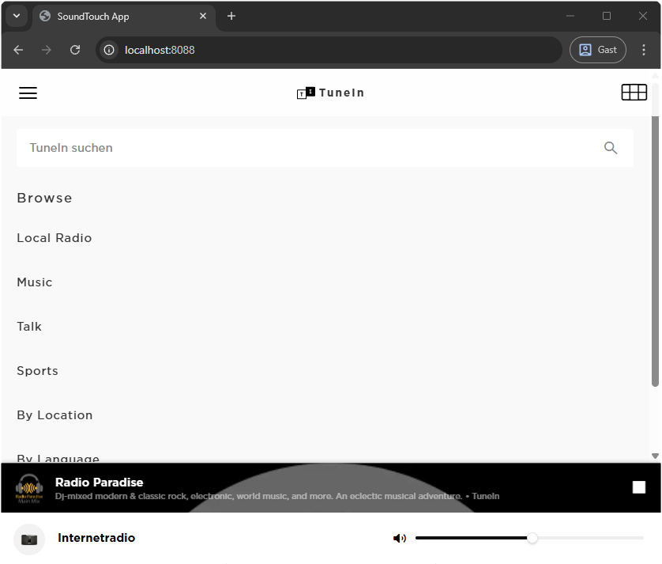

# Soundcork Stockholm App

Clean-room Java middle layer for running the Bose SoundTouch Stockholm frontend in a browser without the Android `Native` bridge.
It can be used as a frontend for the [soundcork](https://github.com/deborahgu/soundcork) project.

This project is under active development. Expect bugs and limitations.

> [!WARNING]
> Bose says SoundTouch cloud support ends on May 6, 2026. Login against Bose servers already appears unreliable. If you want to this app for dev purposes against the Bose cloud you should use SoundTouch account ID, and credentials like `margeAccountID` and `margeAuthToken` from `%AppData%\SoundTouch\config.ini` Windows SoundTouch app before May 6, 2026.

> [!TIP]
> Bose has made SoundTouch technical material available for community tooling, and Stockholm source/archive material is publicly available. We believe using the Stockholm code with this project is permitted.
> This project does not bundle the Stockholm frontend itself. Please download it from, e.g. the Internet Archive at https://archive.org/download/bose-soundtouch-software-and-firmware/Programs/Interface/ - choose the Stockholm zip file with version `27.0.13-4277-8963611`.
> After downloading, copy the Stockholm archive into the `stockholm_zip` folder of this project. It will be expanded and patched to run with the backend.



## Current Scope

- Serves the `stockholm` frontend on `http://127.0.0.1:8088/`
- Implements a queue-backed `Native.appSend(...)` / `Native.runQueue()` bridge
- Proxies browser cross-origin HTTP(S) requests through `/api/http-proxy`
- Persists `getData` / `setData` values under `state/native-state.json`
- Seeds `margeAuthToken` and `margeAccountID` from environment variables when provided
- Reads backend configuration from `config/backend-config.json`
- Uses backend configuration to control frontend `loggingLevel` / `showDebug`
- Implements SSDP-based speaker discovery for `getDeviceList`
- Implements SSDP-based media-server discovery for `getHrmsList`
- Implements basic callback methods used during browser startup:
  - `getLanStatus`
  - `getTimeZone`
  - `getLegalDocPath`
  - `getConstant`
  - `canPerformAutoAPSetup`

### Not Implemented Yet

- Android-only setup flows such as Wi-Fi provisioning (`getNetStats`, `getSSIDList`, `setSSID`)
- Native websocket shims for old Android browser constraints
- App/gui update install flows
- OAuth handoff flows that depended on mobile-native wrappers

## Docker Run

Docker is the recommended way to run the backend. Customize it via the `.env` file. Use `.env.example` as a template.

1. Copy the example environment file and edit it:

```shell
cp .env.example .env
```

2. Download the Stockholm archive and place it here:

```text
stockholm_zip/stockholm.zip
```

The compose file mounts the `stockholm_zip` directory instead of mounting `stockholm.zip` directly. This avoids a Docker Desktop/Windows pitfall where a missing file bind mount can be created as a directory.

3. Start the app:

```shell
docker compose up --build
```

After starting the backend, open:

```text
http://127.0.0.1:8088/
```

## Environment

The compose setup uses `.env` for interpolation. It intentionally does not use `env_file`, because Compose gives explicit `environment` entries precedence over `env_file` values and that made local overrides confusing.

Common values:

```env
TZ=Europe/Berlin
BACKEND_BIND_IP=0.0.0.0
BACKEND_PORT=8088
BACKEND_URL=http://soundcork:8000
AUTH_SERVICE_URL=http://soundcork:8000/marge/
```

Optional Marge session values:

```env
MARGE_AUTH_TOKEN=
MARGE_ACCOUNT_ID=
```

`MARGE_AUTH_TOKEN` is the auth string stored by the Stockholm/SoundTouch flow. The backend also accepts `margeAuthToken` and `margeAccountID` aliases.

If these variables are set, they overwrite the same keys in `state/native-state.json` on startup and are persisted there. If they are absent, values in `state/native-state.json` will be used if existing. Treat both `.env` and `state/native-state.json` as sensitive local files.

## Networking

The default compose file uses host networking so SSDP multicast discovery works by default on Linux and other host-network-capable setups.

If you are on Windows or otherwise need bridge networking, use the override file:

```shell
docker compose -f docker-compose.yml -f docker-compose.windows.yml up --build
```

The override restores port publishing and bridge networking for Docker Desktop setups that do not support host networking.

## Local Java Run

You can also run the backend locally with Java 21 and Gradle:

```shell
./gradlew run
```

Note that if you run the service outside of docker then you will need to unzip and patch Stockholm on your own (or run the docker setup first).  See `docker-entrypoint.sh` for details.

To disable frontend debug logging, set `frontendLoggingLevel` to `0` in `config/backend-config.json`.

## Logging in

If using soundcork as the backend, you can login to your account just using your account number and any domain as an email address, plus any password.  So `1234567@example.com`

After you log in for the first time, the app will try to take you through setting up your speakers.  If you have already configured all of your speakers, you should be able just to refresh `http://localhost:8088/` and access the main app.

## Known Issues

- Bose login/OAuth flows appear to be unavailable and may become impossible as the SoundTouch cloud shutdown approaches.
- HTTP reverse proxies do not yet work reliably; avoid TLS encrypted reverse proxies for now.
- Since this app connects to SoundTouch speakers via unencrypted WebSockets, the browser may block the connection if the frontend is served over HTTPS. Use HTTP for the frontend.
